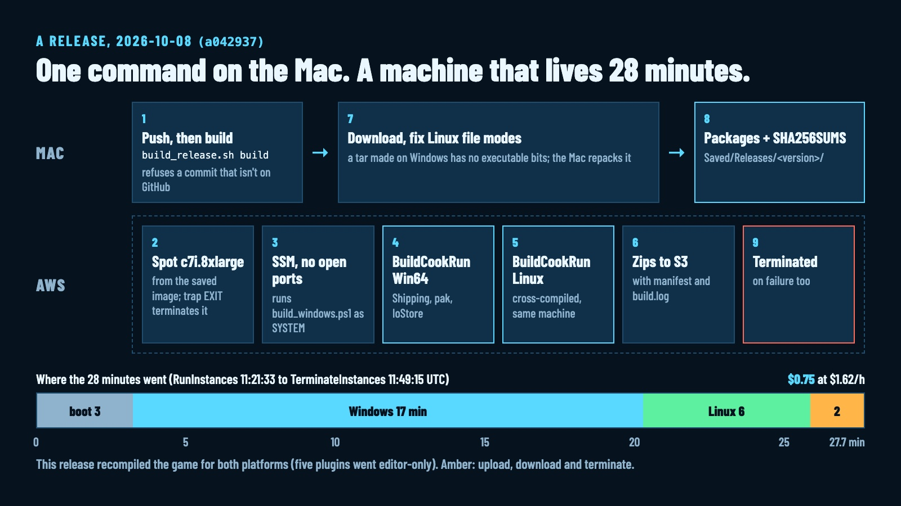
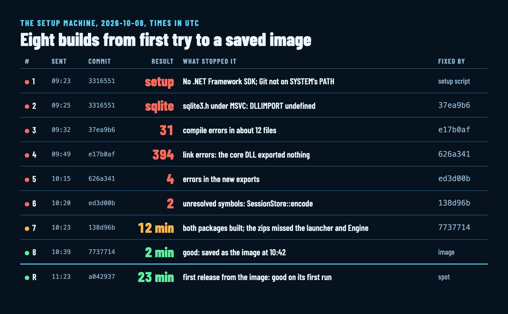
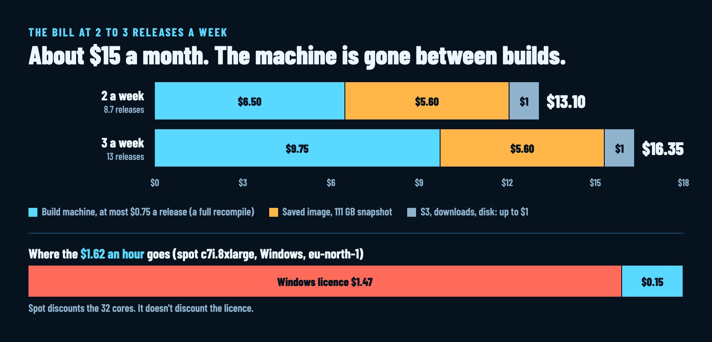

# One Mac, One Rented Windows Box: Shipping an Unreal Game to Three Platforms [Full Setup]

> **For the X composer** (delete this note before pasting):
> - **Header image:** `ringshadow-release-builds/thumb.jpg` (2000 × 800, the 5:2 header).
> - **Inline images,** with Insert → Media where each `![…]` line is: `pipeline.jpg`, `rounds.jpg`, `bill.jpg`.
> - **Code:** each fenced block goes in with Insert → Code.
> - **Tables:** each table goes in with Insert → Table.
> - **Sources:** every number is measured. The sources are listed at the end of this file, under the closing line, and stay out of the post.

Until this morning, Ringshadow ran on one computer: my Mac.

Ringshadow is a real-time strategy game in Unreal Engine 5. Claude Code writes the code, about 96,000 lines of C++, and I direct. Today it got a Windows build and a Linux build, made on a rented machine in Stockholm that exists for less than half an hour per release.

Numbers from today:

- **4 hours 20 minutes** from asking "which platforms can this Mac build for?" to the first Windows and Linux packages, AWS account setup included.
- **28 minutes** from "start a machine" to both packages on my Mac, for a release that recompiles everything.
- **$0.75** for that release. **About $15 a month** at 2 to 3 releases a week, the stored machine image included.
- **$9** for the one-time setup.



**Success rate:** 7 builds on the setup machine before the first good pair. The first release from the saved image worked on its first run.

**Status:** nobody has played the Windows or Linux build yet. More on that at the end.

Below is the full setup: every command, every compiler fix, the trap after the build, and the bill. All of it is in the repo, public domain.

> A Mac can't build an Unreal game for Windows or Linux.

That one fact decides the whole design.

## Why one Windows machine builds two platforms

Unreal on macOS packages for Apple platforms only. An x86 virtual machine on Apple silicon is far too slow to cook a game. So Windows and Linux need a real x86 machine.

**One Windows machine covers both.** The Unreal Engine you install from the Epic launcher on Windows packages Windows natively and Linux through Epic's cross toolchain. On a Linux host you'd have to build the engine from source first.

**One Linux build runs on Ubuntu, Arch and the rest.** Unreal's Linux target ships its own C++ runtime and needs only glibc and a Vulkan driver.

| Platform | Built on | Package |
|---|---|---|
| Windows x64 | an EC2 Windows machine, UE 5.8 from the Epic launcher | `Ringshadow-<version>-windows.zip` |
| Linux x64 | the same machine, cross-compiled | `Ringshadow-<version>-linux.tar.gz` |
| macOS (Apple silicon) | my Mac | `Ringshadow-<version>-mac.zip` |

The machine is a `c7i.8xlarge`: 32 vCPU, Windows Server 2022, in `eu-north-1`. It runs only while it builds. Everything else starts from a saved disk image.

## The one-time setup

**Build the machine once, save it as an image, and every release starts from that image.** The setup took 3 hours of an on-demand machine today, about $9, and most of it was fixing our code for Microsoft's compiler.

**Step 1: The AWS pieces.** Tag every one `Project=ringshadow`, so one filter finds them all and one command cleans them up.
- **Bucket:** private, with objects expiring after 60 days.
- **Instance role:** SSM, plus read and write on that bucket.
- **Security group:** zero inbound rules. Commands and remote desktop both go through SSM.
- **Key pair:** used only to decrypt the Windows Administrator password.

Before the first launch, check two account limits. Our account allowed 32 vCPU of standard instances, which is exactly one `c7i.8xlarge`, so the setup machine and a release can't run side by side. And our organization's policy allows EC2 only in `eu-north-1`, which settled the region.

Done when `aws ec2 describe-instances --filters Name=tag:Project,Values=ringshadow` answers in your region without an error.

**Step 2: The setup machine and its toolchain.** Start an on-demand `c7i.8xlarge` from the newest Windows Server 2022 image with a 400 GB gp3 disk, and install the build tools through SSM, unattended. The versions come from the engine's own `Engine/Config/Windows/Windows_SDK.json`:

```powershell
vs_BuildTools.exe --quiet --wait --norestart --nocache --installPath C:\BuildTools `
  --add Microsoft.VisualStudio.Workload.VCTools --includeRecommended `
  --add Microsoft.VisualStudio.Component.VC.14.44.17.14.x86.x64 `
  --add Microsoft.VisualStudio.Component.Windows11SDK.22621 `
  --add Microsoft.Net.Component.4.6.2.TargetingPack `
  --add Microsoft.Net.Component.4.8.SDK      # UBT needs NETFXSDK for SwarmInterface
```

Then Git and the AWS CLI, and three settings that save a failed build each:

```powershell
git config --system core.longpaths true
git config --system --replace-all safe.directory '*'   # builds run as SYSTEM, people as Administrator
# Defender scans every file a compile or a cook writes: leave the build out
foreach ($Dir in 'C:\build', 'C:\Program Files\Epic Games', 'C:\BuildTools') {
  Add-MpPreference -ExclusionPath $Dir }
```

The script finishes in about 5 minutes, and the Visual Studio installer keeps working in the background for a few more.

**The compiler folder looks wrong, and it's fine.** MSVC 14.44 installs into `14.44.35207`, a folder name inside the range the engine bans. Visual Studio updates `cl.exe` in place, and Unreal reads the version from `cl.exe` itself.

Done when `cl.exe` reports 19.44.35229 or newer and the Windows SDK 10.0.22621 folder exists.

**Step 3: The part that needs hands.** The Epic Games Launcher has no unattended install. Open remote desktop through an SSM tunnel:

```bash
aws ssm start-session --target "$ID" --document-name AWS-StartPortForwardingSession \
  --parameters 'portNumber=["3389"],localPortNumber=["13389"]'
# then point Windows App (Mac App Store) at localhost:13389
```

On the machine:
1. Install the launcher and sign in with your Epic account.
2. Install the engine version your Mac uses (5.8.3 here) at the default path. In its Options, tick **Linux** and untick Starter Content, Templates and the editor debug symbols.
3. Run the Linux cross toolchain installer named in `Engine/Config/Linux/Linux_SDK.json` (`v26_clang-20.1.8-rockylinux8.exe` for 5.8). It sets `LINUX_MULTIARCH_ROOT`.
4. Sign out of the launcher. The builds run the engine straight from its folder, and the image then carries no Epic session.

Three things that bit today:
- **The Linux tick didn't take.** The engine had prebuilt libraries only under `Engine\Intermediate\Build\Win64`. The fix lives on the engine's tile in the Library tab: its own ▾, then Options, tick Linux, Apply. It downloads only the Linux part.
- **Launch opens the editor, which then dies:** the machine has no GPU. Compiling, cooking and packaging run fine without one.
- **The ▾ at the top right of the launcher** only switches which version Launch opens. The Options menu is on the tile.

Done when `Engine\Intermediate\Build\Linux` exists in the engine folder, `LINUX_MULTIARCH_ROOT` is set, and the launcher is signed out.

**Step 4: A warm build, then the image.** Build once on the setup machine, so the image keeps the compiled engine modules and the shader cache. This first build is where every packaging problem shows up, and the setup machine is still there to look at them over remote desktop. Then save the image and terminate the machine. Saving our 400 GB disk took about 15 minutes.

Done when `aws ec2 describe-images --owners self` shows the image `available` and no Ringshadow machine is running.

## A release, step by step

Here is today's release of commit `a042937`, the one in the diagram above.

**Step 1: Push.** The build machine clones from GitHub, so the script checks the commit is there first.

```bash
git push
unreal/Tools/release/build_release.sh build        # HEAD, or a tag, a branch, a commit
```

**Step 2: A spot machine from the image.** A one-time spot request that terminates on interruption, with a disk that dies with the machine:

```bash
aws ec2 run-instances --image-id "$AMI" --instance-type c7i.8xlarge --count 1 \
  --iam-instance-profile Name=ringshadow-build --security-group-ids "$SG" \
  --block-device-mappings 'DeviceName=/dev/sda1,Ebs={VolumeSize=400,VolumeType=gp3,Iops=6000,Throughput=500,DeleteOnTermination=true}' \
  --instance-market-options 'MarketType=spot,SpotOptions={SpotInstanceType=one-time,InstanceInterruptionBehavior=terminate}' \
  --metadata-options HttpTokens=required \
  --tag-specifications 'ResourceType=instance,Tags=[{Key=Project,Value=ringshadow}]'
```

**Step 3: Make termination unconditional.** Set the trap the moment the instance id comes back. A finished build, a failed one, Ctrl-C and a crash then all end the same way:

```bash
trap "aws ec2 terminate-instances --instance-ids $ID >/dev/null" EXIT
```

**Step 4: Run the build over SSM.** The build script goes to S3, SSM runs it as SYSTEM, and the output lands back in the bucket:

```bash
aws ssm send-command --instance-ids "$ID" --document-name AWS-RunPowerShellScript \
  --output-s3-bucket-name "$BUCKET" --output-s3-key-prefix ssm \
  --parameters '{"commands":["..."],"executionTimeout":["$TIMEOUT"]}'
```

**Step 5: Package each platform.** One Unreal command per platform, Windows first, then Linux:

```powershell
RunUAT.bat BuildCookRun -project=$Project -target=Autocraft -platform=$Platform `
  -clientconfig=Shipping -build -cook -stage -pak -iostore -compressed `
  -archive -archivedirectory=$Out\$Platform\Ringshadow -nodebuginfo `
  -utf8output -unattended -nop4      # Win64 adds -prereqs
```

**Archive into a folder named for the game, and zip that whole folder.** Unreal archives the launcher, the project folder and `Engine` side by side. Our first packages zipped the project folder alone and couldn't run.

Today's `build.log`, in UTC: fetch at 11:24:19, Windows from 11:24:45, Linux from 11:41:51, done at 11:47:48.

**Step 6: Bring it home and fix Linux.** The zips, a manifest and the log go to S3, and the Mac downloads them. A tar made on Windows carries no executable bits, so the Mac repacks the Linux one:

```bash
find "$tmp/Ringshadow" -name '*.sh' -exec chmod 755 {} +
find "$tmp/Ringshadow" -type f -path '*/Binaries/Linux/*' -exec chmod 755 {} +
COPYFILE_DISABLE=1 tar --uid 0 --gid 0 --uname root --gname root --no-mac-metadata \
  -czf "$tgz" -C "$tmp" Ringshadow
```

macOS `find` rejects a nested `-exec`, so keep each `find` to a single one.

**Step 7: The Mac package**, here, from the same commit:

```bash
unreal/Tools/release/build_release.sh mac
```

Done when `unreal/Saved/Releases/<version>/` holds the Windows zip, the Linux tar with its executable bits, `SHA256SUMS`, `manifest.txt` and `build.log`, and `build_release.sh status` shows no running machine.

If AWS reclaims the spot machine mid-build, the script stops with "spot reclaimed?". Run it again, or pass `--on-demand`.

## What broke on the first Windows build

The game had only ever compiled with Clang on a Mac. **It took 8 builds on the setup machine, and each one got one layer further.**



**The surprise: the Shipping target had never been compiled anywhere, the Mac included.** The Mac only ever built the editor, so some of these errors would have stopped a Mac package too.

**Stop the machine while you fix the code.** A stopped instance costs only its disk. Each round is a commit pushed to GitHub, because the machine builds only what's there, and a round on the machine took 3 to 5 minutes until the build got through.

Everything MSVC rejected, with the fix:

- **Two statics in one declaration** inside an exported class:
  ```cpp
  // before
  static std::atomic<int64_t> searchesRun, cellsClosed;
  // after
  static std::atomic<int64_t> searchesRun;
  static std::atomic<int64_t> cellsClosed;
  ```
- **A static defined in the header of an exported class** (`Boost::none`): export the functions one by one and leave the class unexported.
- **Locals that hide class members:** warning C4458, an error in Unreal's Windows build. Rename the locals.
- **Exported classes holding a `TUniquePtr`:** MSVC generates a copy constructor for every exported class. Delete it explicitly.
- **`FStaticMaterial{...}` brace initialisation:** its third field exists only in editor builds. Use the constructor.
- **`FModuleManager::GetModuleFilename`:** a monolithic game has no module files. Guard the call.
- **`TStrongObjectPtr` of a forward-declared type:** include the full header.
- **`AUTOCRAFT_API` on members of a class that's already exported:** remove the inner one.
- **A method named `Forward`:** it hid `Forward<T>` inside Slate's `SLATE_EVENT` macro. It's now `ForwardTo`. **The error pointed at two ordinary macro lines; preprocessing the file on the build machine showed the clash.**
- **A DLL that exported nothing: 394 link errors.** On the Mac, a visibility pragma made every symbol public. MSVC has no equivalent, so each class and function the game calls gets a mark, defined in one header:
  ```cpp
  #if defined(_WIN32)
  #define DLLEXPORT __declspec(dllexport)
  #define DLLIMPORT __declspec(dllimport)
  #else
  #define DLLEXPORT __attribute__((visibility("default")))
  #define DLLIMPORT __attribute__((visibility("default")))
  #endif
  ...
  struct AUTOCRAFTCORE_API SessionStore { ... };
  ```
  That covered 28 classes and the free functions the game uses. **Delete the pragma too: the Mac build then catches a missing mark before Windows does.**
- **Templates across the DLL line:** an explicit instantiation crosses only when it's marked:
  ```cpp
  template AUTOCRAFTCORE_API std::string SessionStore::encode<T>(const T&, bool);
  ```

Why the exports matter in a game that ships as one executable: the cook runs the editor, and on Windows the editor is a set of DLLs.

## The trap after the build

A cooked game reads only what was cooked or staged. **Our first package built fine and would have shipped without its music.**

The checklist for any Unreal game that opens plain files:

- **List them:** every path the game opens from the project folder at runtime. Ours: the music MP3s, the launcher art, two JSON catalogs and the cursors.
- **Stage them loose, at the same paths,** so the code reads them exactly as it does in the editor. In the game module's `Build.cs`:
  ```csharp
  if (Target.Type == TargetType.Game)
  {
      foreach (string Path in new string[] {
          "Resources/Sounds/music/*.mp3",
          "Content-src/launcher/*.jpg",
          "Content/Audio/Sounds.json",
          "Content/Models/ModelCatalog.json",
          "Content/UI/Cursors/*.tiff",   // macOS
          "Content/UI/Cursors/*.png"     // Windows and Linux
      })
          RuntimeDependencies.Add("$(ProjectDir)/" + Path, StagedFileType.NonUFS);
  }
  ```
- **Or stage a whole folder inside the pak,** in `DefaultGame.ini`:
  ```ini
  +DirectoriesToAlwaysStageAsUFS=(Path="Shatter")
  ```
- **Bake both cursor formats.** macOS loads TIFFs. Windows and Linux load `Cursor_<kind>.png` and `Cursor_<kind>@2x.png` beside them and pick by DPI.
- **Keep the editor's plugins in the editor.** Ours run an MCP server and Python, which is how the game gets built. For each one in the `.uproject`:
  ```json
  { "Name": "ModelContextProtocol", "Enabled": true, "TargetAllowList": ["Editor"] }
  ```
  **A player's download carries none of them,** and the Linux package lost the Boost libraries the USD importer had been pulling in.

Done when you list the archive and find every one of those files, and none of the editor plugins.

## The bill

**About $15 a month, and the Windows licence costs more than the 32-core machine.**



| What | Rate | A month at 2 to 3 releases a week |
|---|---|---|
| Spot `c7i.8xlarge`, Windows | $1.62 an hour, $0.75 a release (28 min, a full recompile) | $7 to $10 at most |
| The saved image | a 111 GB snapshot at $0.05 a GB-month | $5.60 |
| S3 (60-day expiry), the downloads, the disk while it runs | about 0.7 GB a release | up to $1 |
| **Total** | | **about $15** |

**Spot discounts the machine and leaves the licence alone.** Of the $1.62 an hour, about $1.47 is the Windows licence. The 32 cores cost about $0.15.

**The $0.75 is the expensive case.** That release changed which plugins the game carries, which recompiles everything, and the image's cache predates it. Refreshing the image after a change like that brings the cache up to date: one release with `--keep`, then `image`.

**One-time: $9.** The setup machine ran 3 hours on demand at about $2.90 an hour, the compiler fixes included.

## How to copy this

**Point your coding agent at `docs/builds.md` and `unreal/Tools/release/` in the repo, and tell it to do the same for your project.** The doc walks the setup step by step, and the script covers every step above: `infra`, `setup`, `rdp`, `image`, `build`, `mac`, `status` and `stop`.

Swap in your project name, bucket and region, and keep these four:
- **The Linux tick:** check `Engine\Intermediate\Build\Linux` exists before the warm build.
- **The sign-out:** sign out of the Epic launcher before you save the image.
- **The trap:** terminate on `EXIT`, set the moment the instance id comes back.
- **The staging list:** every plain file the game opens, staged at its own path.

Everything is CC0. No course to sell you.

## Still open

- **Nobody has played it yet.** The build machine has no GPU. Next is a `g6.2xlarge` (an NVIDIA L4, DX12 and Vulkan) over remote desktop, $0.47 an hour on spot.
- **The Mac build is unsigned.** Gatekeeper makes the player right-click and choose Open. A clean first launch needs a Developer ID certificate, `codesign --options runtime`, `notarytool` and `stapler`.
- **The console art.** The metal dashboard around the HUD was drawn with Core Graphics, which exists only on the Mac, so Windows and Linux got flat colour stand-ins. It's being ported to Unreal's own drawing right now and checked shot by shot against the Mac version.

## What's next

A playtest on Windows and Linux, then the first public release on GitHub.

**On Windows or Linux? Reply with your GPU,** and I'll send you the first build.

I'm building Ringshadow in public with AI agents, one day of work at a time. Follow along: github.com/ValiDraganescu/autocraft

<!--
Sources (2026-10-08, UTC):
- Release a042937: CloudTrail RunInstances 11:21:33, TerminateInstances 11:49:15 (27.7 min). build.log 11:24:19 to 11:47:48; Win64 17.1 min (compile 6.6, cook 8.1), Linux 5.6 min. $1.62/h x 0.46 h = $0.75.
- Build runs: CloudTrail SendCommand "ringshadow build" at 09:23:57, 09:25:48, 09:32:37, 09:49:20, 10:15:43, 10:20:56, 10:23:52, 10:39:06 (setup machine), 11:23:33 (spot). Errors per round: the builds session's transcript.
- Setup machine: RunInstances 07:57:06, TerminateInstances 10:56:38: 3.0 h at about $2.90/h = $8.70, plus disk.
- First question to first pair: 06:16 to 10:37 = 4 h 21 min.
- Snapshot: FullSnapshotSizeInBytes 111,413,297,152 x $0.05/GB-month = $5.57.
- Month: 2/week = 8.7 releases x $0.75 = $6.50; 3/week = 13 x $0.75 = $9.75; + $5.60 + up to $1 = $13.10 to $16.35.
- Spot price and the licence share: docs/builds.md (describe-spot-price-history, 2026-10-08).
-->
